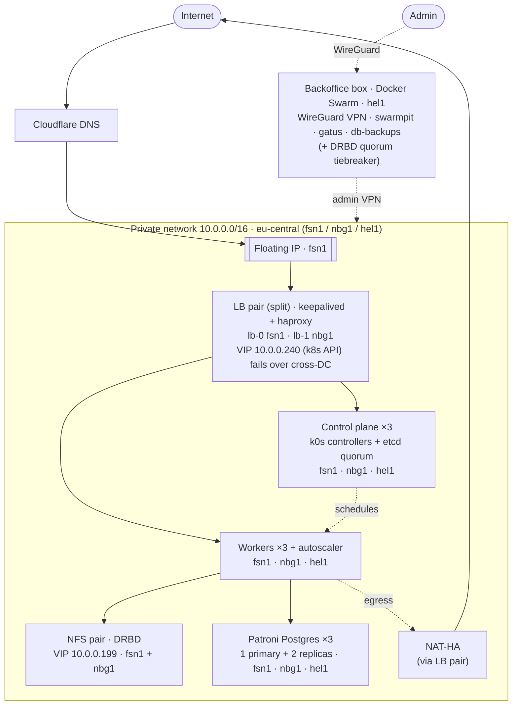

# Highly available multi-zone k0s cluster boilerplate

> by [@misterkuka](https://github.com/misterkuka) · multi-datacenter variant of the
> [single-zone boilerplate](https://github.com/misterkuka)

A **fully HA, multi-datacenter** Kubernetes ([k0s](https://k0sproject.io/)) cluster on
[Hetzner Cloud](https://www.hetzner.com/cloud), provisioned end-to-end as code — **Terraform** for the
infrastructure, **Ansible** for the cluster + stateful HA, and **ArgoCD** (app-of-apps) for everything
running inside. Nodes are spread across **three EU datacenters** (one Hetzner network zone), so no
single node *and no single datacenter* can take the cluster down.

Everything is parameterized and ships with `.example` placeholders — **no real secrets in this repo**.
Fill them in, set your `domain`, and `terraform apply`.

---

## Architecture



<details>
<summary>ASCII fallback</summary>

```
                Internet
                   │
            Cloudflare DNS
                   │
              Floating IP (fsn1)
                   │
   ┌───────────────┴──────────── private net 10.0.0.0/16 · eu-central ────┐
   │   LB pair (split): lb-0 fsn1 · lb-1 nbg1                            │
   │   VIP 10.0.0.240 = k8s API (fails over cross-DC) · ingress = CF LB  │
   │        │                         │                                  │
   │  control plane ×3           workers ×3 ── cluster-autoscaler        │
   │  fsn1·nbg1·hel1                  fsn1·nbg1·hel1                      │
   │                          ┌───────┼─────────┐                        │
   │             NFS pair (DRBD)    Patroni Postgres ×3     NAT-HA        │
   │             fsn1 + nbg1        fsn1·nbg1·hel1          (egress)      │
   └─────────────────────────────────────────────────────────────────────┘
        ▲ admin VPN
   Backoffice box (Docker Swarm, hel1): WireGuard · swarmpit · gatus · db-backups
```
</details>

## How HA is covered

Every layer removes a single point of failure — node-level **and** datacenter-level. The "Implemented
in" column points at the code.

| Layer | SPOF removed by | Survives | Implemented in |
|---|---|---|---|
| **Control plane** | 3 k0s controllers + etcd quorum (one per DC) behind VIP `10.0.0.240` | 1 controller **or a whole DC** | `ansible/playbooks/k0s_main` |
| **Ingress / API LB** | LB pair split **fsn1 + nbg1**; keepalived moves the API VIP `10.0.0.240` cross-DC; public ingress via Cloudflare LB over both LB IPs | 1 LB node **or a DC** down | `ansible/playbooks/loadbalancer`, [`docs/CLOUDFLARE-LB.md`](docs/CLOUDFLARE-LB.md) |
| **Workers** | 3 workers (one per DC) + Hetzner cluster-autoscaler | node loss / DC loss / load spikes | `gitops/base/cluster-autoscaler` |
| **Storage (RWX)** | DRBD NFS pair (fsn1+nbg1), keepalived alias-IP `10.0.0.199`, diskless tiebreaker in hel1 | 1 NFS node **or DC** down | `ansible/playbooks/nfs/nfs_ha` |
| **Database** | 3-node Patroni (one per DC), automatic failover | primary loss **or a DC** | `ansible/playbooks/postgres` |
| **DNS** | Cloudflare as-code, low TTL | record drift / fast cutover | `terraform/cloudflare.tf` |
| **Egress (NAT)** | NAT-HA on the LB pair (route → `10.0.0.210`) | NAT node down | `ansible/playbooks/loadbalancer` |
| **GitOps** | ArgoCD self-heal + app-of-apps | config drift / manual change | `gitops/` |
| **Admin access** | WireGuard bastion (hel1) to the private net | — | `ansible/playbooks/backoffice` |

> The internal API VIP `10.0.0.240` is a subnet alias IP, so keepalived moves it across DCs — the k8s
> API is DC-fault-tolerant. Public ingress uses **Cloudflare Load Balancing** health-checking both LB
> public IPs (fsn1 + nbg1) so a DC loss fails over inbound traffic too — see
> [`docs/CLOUDFLARE-LB.md`](docs/CLOUDFLARE-LB.md). (Interim before CF LB is enabled: a location-bound
> floating IP on fsn1.)

## What's inside

```
terraform/   Hetzner servers/network/volumes/floating IPs + Cloudflare DNS  (+ databasus/ for backups)
ansible/     k0s install, LB/keepalived, DRBD NFS, Patroni Postgres, WireGuard, node tuning
gitops/      ArgoCD app-of-apps: sealed-secrets, traefik, nfs-provisioner, cluster-autoscaler,
             monitoring (Prometheus/Grafana/Alertmanager), hyperdx + otel logs, tetragon, keydb,
             db-access, gatus, woodpecker CI
backoffice/  Docker-Swarm management box: WireGuard VPN, swarmpit, gatus, databasus, db_lb, traefik
docs/        BUILD.md (full runbook) · ADDING_NEW_SERVICE.md · CLOUDFLARE-LB.md (public ingress HA)
```

## Topology & cost (EU, x86 CX, ≈ $103/mo)

3 controllers (CX22) · 3 workers (CX32, + autoscaled burst) · 3 Postgres (CX32) · 2 NFS (CX22, DRBD) ·
2 LB (CX22) · 1 backoffice/NAT (CX22), spread `fsn1`/`nbg1`/`hel1`. Private network `10.0.0.0/16`
(eu-central); IP plan: managers `.3–.49`, workers `.50–.99`, db `.100–.149`, backoffice `.150`,
nfs `.200–.209`, lb `.210–.211`. Inter-DC private traffic is free, so the spread adds no cost.

## Operating it

1. Provision + bring up: **[`docs/BUILD.md`](docs/BUILD.md)** (terraform → ansible → gitops bootstrap).
2. Secrets: fill the gitignored `.example` files; generate a Sealed-Secrets key and reseal the
   placeholder `sealedsecret.yaml` files (`gitops/certs/README.md`).
3. Add a service: **[`docs/ADDING_NEW_SERVICE.md`](docs/ADDING_NEW_SERVICE.md)**.

## Bootstrap order

```
terraform apply
  → ansible: backoffice + loadbalancer
  → ansible: k0s init → add_managers → add_workers
  → ansible: nfs_ha → postgres → node tuning
  → terraform/databasus apply        (optional, DB backups)
  → gitops/bootstrap/bootstrap.sh    (ArgoCD app-of-apps)
```
