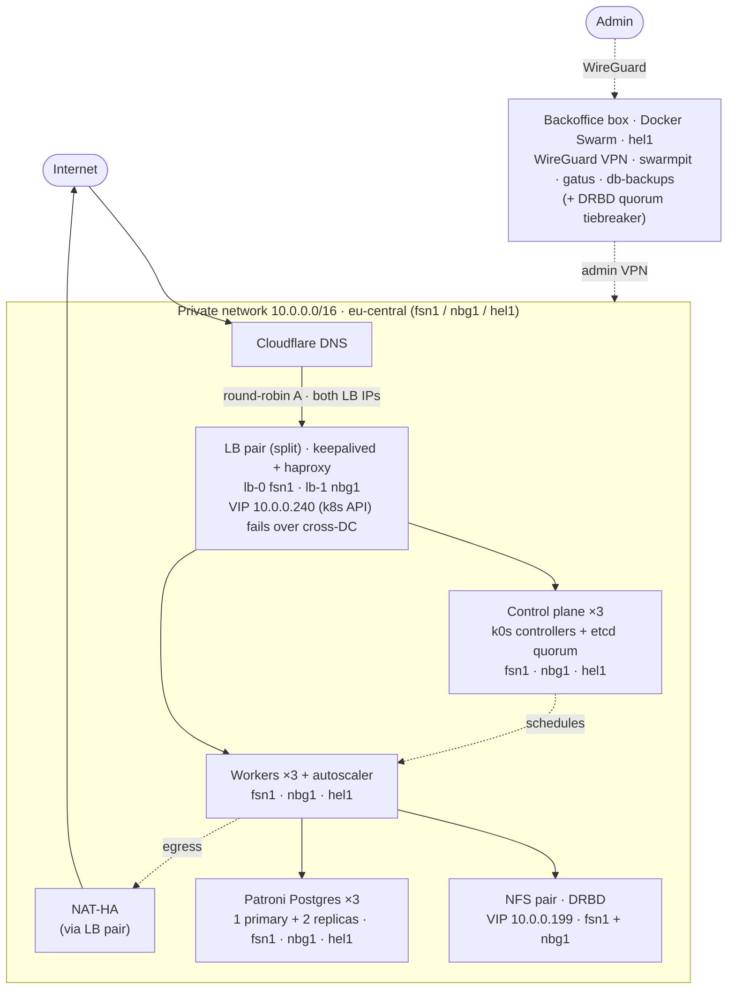

# Highly available multi-zone k0s cluster boilerplate

> by [@misterkuka](https://github.com/misterkuka) · multi-datacenter variant of the
> [single-zone boilerplate](https://github.com/prehoy/k0s-hetzner-boilerplate)

A **fully HA, multi-datacenter** Kubernetes ([k0s](https://k0sproject.io/)) cluster on
[Hetzner Cloud](https://www.hetzner.com/cloud), provisioned end-to-end as code — **Terraform** for the
infrastructure, **Ansible** for the cluster + stateful HA, and **ArgoCD** (app-of-apps) for everything
running inside. Nodes are spread across **three EU datacenters** (one Hetzner network zone), so no
single node *and no single datacenter* can take the cluster down.

Everything is parameterized and ships with `.example` placeholders — **no real secrets in this repo**.
Fill them in, set your `domain`, and `terraform apply`.

---

## Architecture



<details>
<summary>ASCII fallback</summary>

```
                Internet
                   │
            Cloudflare DNS
                   │  round-robin A: both LB IPs
                   │
   ┌───────────────┴──────────── private net 10.0.0.0/16 · eu-central ────┐
   │   LB pair (split): lb-0 fsn1 · lb-1 nbg1                            │
   │   VIP 10.0.0.240 = k8s API (fails over cross-DC)                    │
   │   public ingress = round-robin A across both LB IPs                 │
   │        │                         │                                  │
   │  control plane ×3           workers ×3 ── cluster-autoscaler        │
   │  fsn1·nbg1·hel1                  fsn1·nbg1·hel1                      │
   │                          ┌───────┼─────────┐                        │
   │             NFS pair (DRBD)    Patroni Postgres ×3     NAT-HA        │
   │             fsn1 + nbg1        fsn1·nbg1·hel1          (egress)      │
   └─────────────────────────────────────────────────────────────────────┘
        ▲ admin VPN
   Backoffice box (Docker Swarm, hel1): WireGuard · swarmpit · gatus · db-backups
```
</details>

## How HA is covered

Every layer removes a single point of failure — node-level **and** datacenter-level. The "Implemented
in" column points at the code.

| Layer | SPOF removed by | Survives | Implemented in |
|---|---|---|---|
| **Control plane** | 3 k0s controllers + etcd quorum (one per DC) behind VIP `10.0.0.240` | 1 controller **or a whole DC** | `ansible/playbooks/k0s_main` |
| **Ingress / API LB** | LB pair split **fsn1 + nbg1**; keepalived moves the API VIP `10.0.0.240` cross-DC; public ingress = round-robin A records across both LB IPs (browser retries the live one) | 1 LB node **or a DC** down | `ansible/playbooks/loadbalancer`, `terraform/cloudflare.tf` |
| **Workers** | 3 workers (one per DC) + Hetzner cluster-autoscaler | node loss / DC loss / load spikes | `gitops/base/cluster-autoscaler` |
| **Storage (RWX)** | DRBD NFS pair (fsn1+nbg1), keepalived alias-IP `10.0.0.199`, diskless tiebreaker in hel1 | 1 NFS node **or DC** down | `ansible/playbooks/nfs/nfs_ha` |
| **Database** | 3-node Patroni (one per DC), automatic failover | primary loss **or a DC** | `ansible/playbooks/postgres` |
| **DNS** | Cloudflare as-code, low TTL | record drift / fast cutover | `terraform/cloudflare.tf` |
| **Egress (NAT)** | NAT-HA on the LB pair (route → `10.0.0.210`) | NAT node down | `ansible/playbooks/loadbalancer` |
| **GitOps** | ArgoCD self-heal + app-of-apps | config drift / manual change | `gitops/` |
| **Admin access** | WireGuard bastion (hel1) to the private net | — | `ansible/playbooks/backoffice` |

> The internal API VIP `10.0.0.240` is a subnet alias IP, so keepalived moves it across DCs — the k8s
> API is DC-fault-tolerant. Public ingress is **round-robin A records across both LB public IPs**
> (fsn1 + nbg1) — free, 2-DC reachable, and a browser retries the other LB if one is down. For
> production, customer-facing services that need *health-checked, instant* failover, put them behind
> **Cloudflare Load Balancing** (template in [`docs/CLOUDFLARE-LB.md`](docs/CLOUDFLARE-LB.md) /
> `terraform/cloudflare-lb.tf`).

## What's inside

```
terraform/   Hetzner servers/network/volumes/primary IPs + Cloudflare DNS  (+ databasus/ for backups)
ansible/     k0s install, LB/keepalived, DRBD NFS, Patroni Postgres, WireGuard, node tuning
gitops/      ArgoCD app-of-apps: sealed-secrets, traefik, nfs-provisioner, cluster-autoscaler,
             monitoring (Prometheus/Grafana/Alertmanager), hyperdx + otel logs, tetragon, keydb,
             db-access, gatus, woodpecker CI
backoffice/  Docker-Swarm management box: WireGuard VPN, swarmpit, gatus, databasus, db_lb, traefik
docs/        BUILD.md (full runbook) · ADDING_NEW_SERVICE.md · CLOUDFLARE-LB.md (public ingress HA)
```

## Topology & cost (EU, x86 CX, ≈ $103/mo)

3 controllers (CX22) · 3 workers (CX32, + autoscaled burst) · 3 Postgres (CX32) · 2 NFS (CX22, DRBD) ·
2 LB (CX22) · 1 backoffice/NAT (CX22), spread `fsn1`/`nbg1`/`hel1`. Private network `10.0.0.0/16`
(eu-central); IP plan: managers `.3–.49`, workers `.50–.99`, db `.100–.149`, backoffice `.150`,
nfs `.200–.209`, lb `.210–.211`. Inter-DC private traffic is free, so the spread adds no cost.

## Operating it

1. Provision + bring up: **[`docs/BUILD.md`](docs/BUILD.md)** (terraform → ansible → gitops bootstrap).
2. Secrets: fill the gitignored `.example` files; generate a Sealed-Secrets key and reseal the
   placeholder `sealedsecret.yaml` files (`gitops/certs/README.md`).
3. Add a service: **[`docs/ADDING_NEW_SERVICE.md`](docs/ADDING_NEW_SERVICE.md)**.

## Bootstrap order

```
terraform apply
  → ansible: backoffice + loadbalancer
  → ansible: k0s init → add_managers → add_workers
  → ansible: nfs_ha → postgres → node tuning
  → terraform/databasus apply        (optional, DB backups)
  → gitops/bootstrap/bootstrap.sh    (ArgoCD app-of-apps)
```

## What it costs — vs managed GKE / EKS / DOKS

This is the pitch. You get **managed-grade HA** — 3-node control plane, autoscaling, HA
Postgres, HA storage, LB failover — at **self-managed prices**, because Hetzner doesn't charge
a control-plane fee and its egress is effectively free. This repo is what automates the "self-managed"
part away.

Same cluster, four providers. On-demand, NET (ex-VAT), **730 hrs/mo**, EU regions, matched instance
classes (RAM noted where a provider has no exact shape). Managed control planes (GKE-regional,
EKS, DOKS-HA) bundle HA into their fee; on Hetzner you run three small controllers — priced in below.

### Small · non-HA (dev/staging) — 3× 4 vCPU / 8–16 GB · 1 LB · 100 GB

| | **Hetzner (this repo)** | GKE | EKS | DOKS |
|---|--:|--:|--:|--:|
| Monthly | **≈ $217** | $351 | $524 | $166 |

> The one config where DigitalOcean's shared droplets undercut Hetzner. Fine — these are *HA*
> boilerplates; the fight that matters is below.

### Medium · HA (prod baseline, ≈ this boilerplate's shape) — HA control plane + 4× 4 vCPU / 16 GB · 2 LB · 500 GB

| | **Hetzner (this repo)** | GKE | EKS | DOKS |
|---|--:|--:|--:|--:|
| Monthly | **≈ $529** | $590 | $808 | $618 |
| vs Hetzner | — | +12% | **+53%** | +17% |

### Large · HA — HA control plane + 8× 8 vCPU / 32 GB · 3 LB · 2 TB

| | **Hetzner (this repo)** | GKE | EKS | DOKS |
|---|--:|--:|--:|--:|
| Monthly | **≈ $1,568** | $2,050 | $2,999 | $2,292 |
| vs Hetzner | — | +31% | **+91%** | +46% |

### …then egress makes it a rout

The tables above are *before traffic*. Push **5 TB/mo** outbound — a modest API/app load — and the
gap explodes:

| | Hetzner | DOKS | GKE | EKS |
|---|--:|--:|--:|--:|
| Egress on 5 TB/mo | **$0** | **$0** | ≈ $600 | ≈ $450 |

Hetzner includes **20 TB per server** (overage €1/TB); DigitalOcean pools a free multi-TB allotment.
GKE bills **$0.12/GB** and EKS **$0.09/GB** — so on a busy prod cluster egress alone can cost more than
the entire Hetzner bill.

**The honest asterisk:** "managed" clusters give you a vendor-run, SLA-backed control plane. Here *you*
own the three controllers — but Terraform + Ansible + ArgoCD in this repo stand them up and keep them
healed, so the operational delta is small and the savings are not. Prices are list rates as of 2026
(Hetzner post-June-2026 hike); your mileage varies with commitments/savings plans on the hyperscalers.
Track your real bill with **[hetzner-cost-monitor](https://github.com/prehoy/hetzner-cost-monitor)**.

Spreading these same nodes across three datacenters (this variant) adds **$0** — inter-DC private
traffic inside a Hetzner network zone is free.

## Related projects

- **[k0s-hetzner-boilerplate](https://github.com/prehoy/k0s-hetzner-boilerplate)** — the single-zone
  variant: same batteries-included HA stack, all in one datacenter. Simpler and slightly cheaper; use it
  when full-DC redundancy isn't a requirement.
- **[hetzner-cost-monitor](https://github.com/prehoy/hetzner-cost-monitor)** — a self-hostable cost
  explorer for Hetzner Cloud (live €/hr burn, month-to-date, spend by project/type/location). Point it
  at the same project to watch what this cluster actually costs; it deploys onto the cluster you just
  built.
